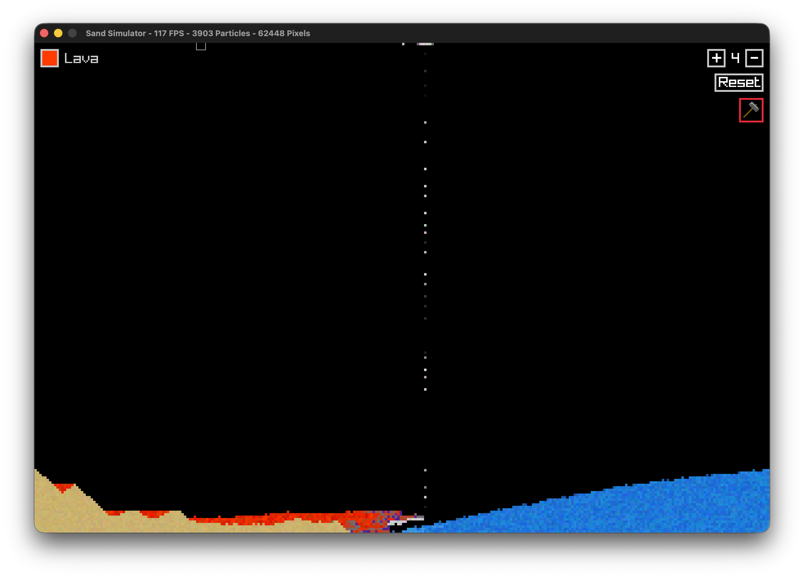

# Fast Sand Sim in C

---

This is a Sand Particle Simulator writin in C with the Raylib Library.

## Features

Particle Types:

- Sand
- Water
- Lava
- Stone
- Obsidian
- Ice
- Steam
- Napalm

Other:

- Hammer to destroy any particles
- Change amount of particles placed at once

## About the code

The core function of the code works by using two large arrays, the first is an array called pixelColors, it is screenWidth \* screenHeight in length and holds color data for every pixel on the screen. The second array named pixels is an array of length gridWidth \* gridHeight where gridWidth = screenWidth / drawSize and vice versa, and holds data for every particle such as its type and cordinates (drawSize^2 is the number of physical pixels in a single particle). Using these, the program runs an update loop with definied behavior for each type.

Through my testing it runs extreamly well rendering fluid 60,000 particles (960,000 pixels at drawSize 4) at 120 fps, but I cap it at 60 because I like it more. Using a bigger monitor I was able to push the program a bit more. It ran 203,125 fluid particles or 3,250,000 pixels at ~ 30 fps.

## Credits

All Code writin by Cory Pearl for free use to anyone.
